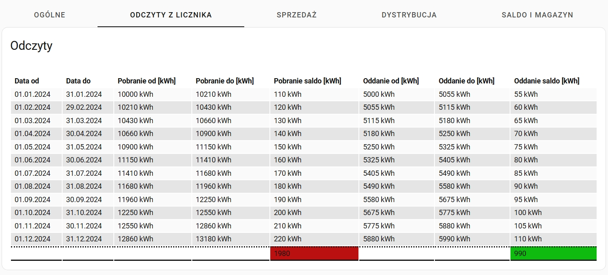
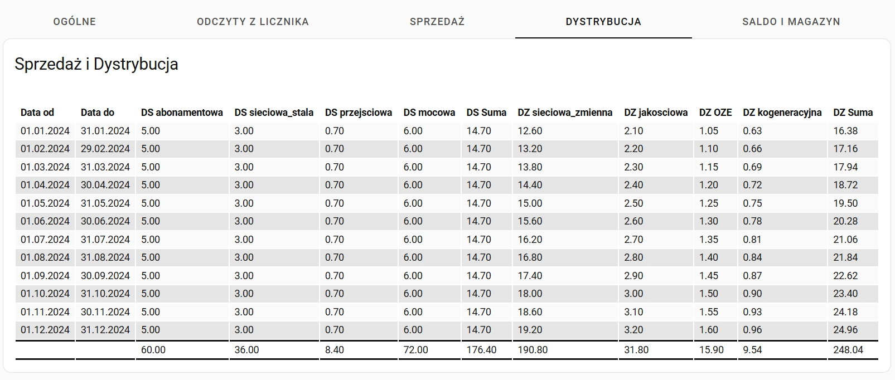

# Energa PDF Parser

This repository provides Python scripts for processing electricity invoices from Energa, a Polish energy distribution company. The scripts extract key information - including metering data, sales, distribution charges, and energy balances - and export it either to MQTT or CSV for further use.

## Requirements for Home Assistant UI

The YAML card you’ll add separately uses these custom Lovelace cards:
- [custom-cards/flex-table-card](https://github.com/custom-cards/flex-table-card) - a highly flexible table card.
- [kinghat/tabbed-card](https://github.com/kinghat/tabbed-card) - a card that provides a tabbed interface.

## Screenshot

## License  
MIT License
